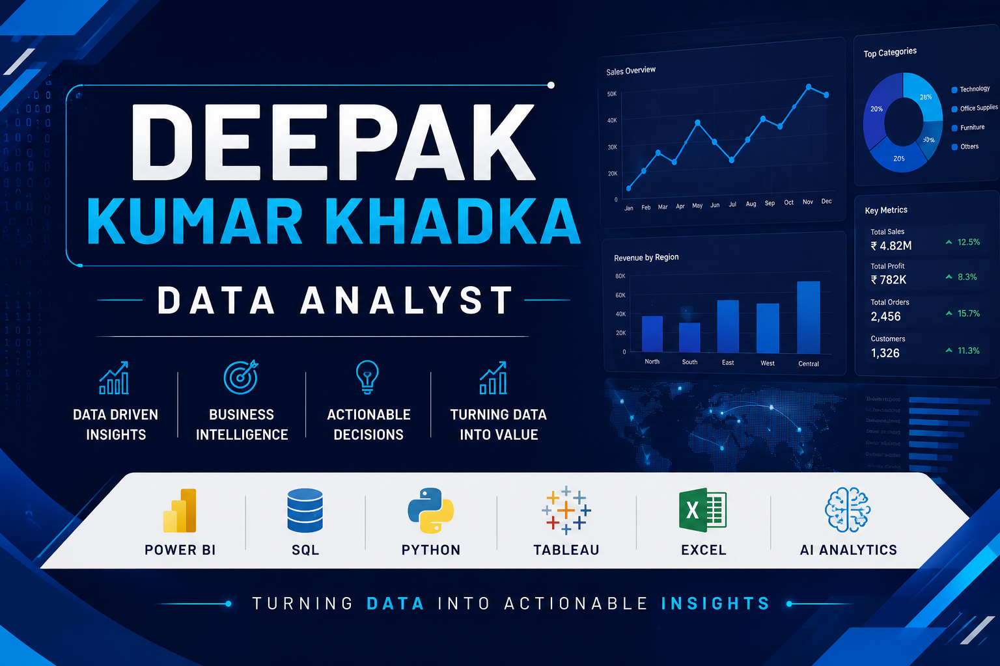

  

<h1 align="center">Hi 👋, I'm Deepak Kumar Khadka</h1>

<h3 align="center">
Data Analyst • Business Intelligence Analyst • AI-Assisted Analytics
</h3>

  

---

# 👨‍💻 About Me

📍 Bengaluru, India

🎓 Bachelor of Commerce (B.Com)

💼 Customer Service Support Operator at Siemens Healthineers

📊 Aspiring Data Analyst passionate about transforming raw data into meaningful business insights using analytics, visualization, and AI-assisted workflows.

🚀 I enjoy solving business problems through dashboards, SQL analysis, automation, and interactive reporting while responsibly leveraging AI tools to improve productivity.

---

# 💻 Technical Skills

## Programming

## Data Analytics

## AI Tools

## Development Tools

---

# 📂 Featured Projects

## 📊 AI-Assisted Retail Sales Analytics Dashboard

End-to-end analytics project covering data cleaning, SQL analysis, KPI reporting, and interactive Power BI dashboards. AI tools were leveraged to accelerate documentation, code refinement, and workflow efficiency while all business analysis was manually validated.

**Tools:** Python • SQL • Power BI • Excel • ChatGPT • Google Gemini

---

## 👥 HR Analytics & Workforce Insights Dashboard

Interactive Tableau dashboard analyzing employee attrition, workforce demographics, and organizational KPIs to support data-driven HR decision-making.

**Tools:** Python • SQL • Tableau • Excel

---

# 🏆 Certifications

✔ Advanced Certification in Data Science & AI – E&ICT Academy IIT Guwahati

✔ Google Advanced Data Analytics Professional Certificate

✔ Deloitte Data Analytics Job Simulation

✔ IBM Data Analytics / Generative AI Certifications

---

# 🌱 Currently Learning

- Advanced SQL
- Power BI Development
- Tableau Storytelling
- AI-Assisted Analytics
- Data Engineering Fundamentals

---

# 🎯 Career Objective

To build a successful career as a Data Analyst by transforming data into actionable insights, creating impactful dashboards, and supporting business decisions through analytics and responsible AI-assisted workflows.

---

# 🤝 Connect With Me

💼 LinkedIn

https://www.linkedin.com/in/deepak-khadka-78869a221

📧 Email

deepakkumarkhadka02@gmail.com

🌐 Portfolio

https://deepak-webfolio.surge.sh

---

⭐ Turning Data Into Business Insights Through Analytics & AI ⭐

