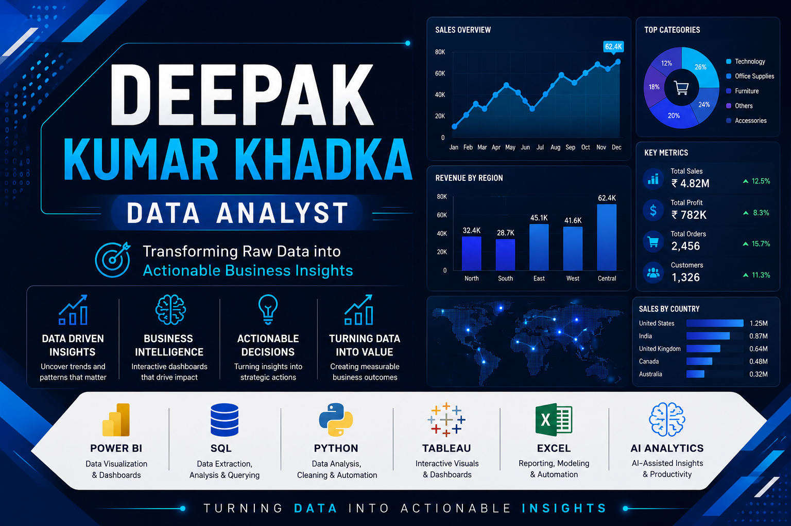

  

<h1 align="center">
Hi 👋, I'm Deepak Kumar Khadka
</h1>

<h3 align="center">
Data Analyst • Business Intelligence Analyst
</h3>

SQL • Python • Power BI • Tableau • Excel • AI-Assisted Analytics

  
  &nbsp;
  
  &nbsp;
  

---

## 👨‍💻 About Me

I'm an aspiring **Data Analyst** with professional experience in **Order-to-Cash (O2C) Operations** and a strong interest in transforming data into actionable business insights.

My analytics journey focuses on applying **SQL, Python, Power BI, Tableau, and Excel** to solve business problems through data cleaning, exploratory analysis, KPI tracking, dashboard development, and reporting.

To strengthen my practical skills, I build end-to-end analytics projects using real-world datasets and leverage AI tools responsibly to improve productivity while maintaining analytical thinking.

### What you'll find in this GitHub

- 📊 End-to-end Data Analytics Projects
- 📈 Interactive Power BI & Tableau Dashboards
- 🐍 Python for Data Cleaning & Analysis
- 🗄️ SQL Queries & Business Insights
- 📑 Excel Dashboards & Reporting
- 🤖 AI-assisted Analytics Workflows
- 📚 Continuous Learning & Certifications

---

## 🛠️ Tech Stack & Tools

### Programming & Query Languages

### Data Visualization & Analytics

### Libraries & Frameworks

  

### Development Tools

### Currently Learning

---

# 🚀 Featured Projects

<table>
<tr>

<td width="50%" valign="top">

## 📊 AI-Assisted Retail Sales Analytics

An end-to-end analytics project demonstrating how AI can support the data analysis workflow, from data preparation to dashboard creation and business insights.

### Highlights

- 📌 Data Cleaning & Preparation
- 📈 Exploratory Data Analysis (EDA)
- 📊 Interactive Dashboard
- 🤖 AI-Assisted Analytics Workflow
- 💡 Business Insights & Recommendations

**Tech Stack**

`Python` `SQL` `Power BI` `Excel`

 

</td>

<td width="50%" valign="top">

## 👥 HR Analytics & Attrition Dashboard

A workforce analytics project focused on employee attrition trends, HR KPIs, and interactive dashboard reporting for data-driven decision-making.

### Highlights

- 📌 Data Cleaning
- 📉 Attrition Analysis
- 👥 Workforce Insights
- 📊 Interactive Tableau Dashboard
- 💡 Business Recommendations

**Tech Stack**

`Python` `SQL` `Tableau`

 

</td>

</tr>
</table>

---

# 🌐 Portfolio Website

Explore my complete portfolio, featured projects, certifications, technical skills, and professional journey.

---

# 🏆 Certifications

<table>
<tr>
<td>

🎓 **Advanced Certification in Data Science & AI**  
E&ICT Academy, IIT Guwahati (via Besant Technologies)

</td>
<td>

📊 **Google Advanced Data Analytics Professional Certificate**

</td>
</tr>

<tr>
<td>

💼 **Deloitte Data Analytics Job Simulation**  
Forage

</td>
<td>

🤖 **Microsoft Generative AI for Data Analysis**

</td>
</tr>
</table>

> *Continuous learning is an important part of my professional journey. I regularly build projects to strengthen my practical analytics skills.*

---

# 📫 Let's Connect

&nbsp;

&nbsp;

---

⭐ Thanks for visiting my GitHub profile!   
I'm always open to connecting, collaborating, and learning through data-driven projects.

